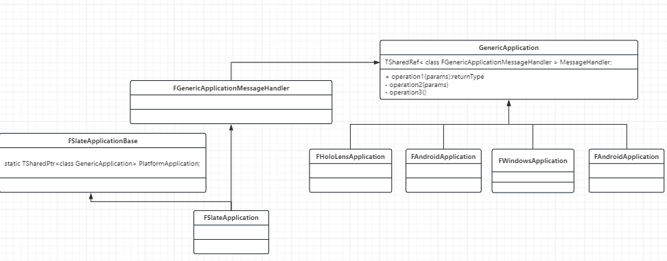

# Rotation

什么是一个好的插值？

rotation is valid at anytime

constant rotational speed is preferred.

&#x20;&#x20;

欧拉角

## Axis Angles

$$(u,\theta)$$

向量 $$u$$旋转的轴

标量 $$\theta$$ 旋转的角度

轴角表示的特点。容易插值而且没有Gimbal Lock 万向锁

## &#x20;

## Quaternions

Conjugation:&#x20;

$$q^* = a-bi-cj-dk$$

Scalar product: $$tq = ta + tbi + tcj + tdk$$

Addition:

$$q_1+q_2 = (a_1+a_2)+(b_1 + b_2)i + (c_1+c_2)j$$

Dot Product:

$$q_1 * q_2 = a_1a_2 + b_1b_2+c_1c_2+d_1d_2$$

### Quaternion Arithmetic

和矩阵一样，四元数不支持交换律但是支持结合律。

## Unit Quaternions

单位四元数 模长为1的四元数。单位四元数可以看成是四维空间单位球体上的一个点。

Unit quaternion: $$q = [cos \frac{\theta}{2},usin\frac{\theta}{2}]$$

我们的目的是将原始的三维向量 $$p$$ 旋转到最终的结果 $$p^{'}$$

<figure><figcaption></figcaption></figure>

q 和 -q 表示的是相同的旋转。

一个四元数的负和它的本身代表的是相同的旋转。

<figure><figcaption></figcaption></figure>

## Quaternion Interpolation

###

### &#x20;
