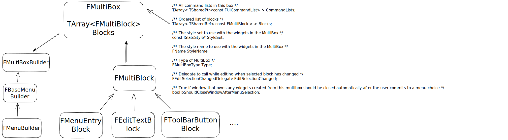

# 🖐 UObject

## UObject

UObject并不是最上层的基类，其中最上层的基类是UObjectBase，他在创建的时候会把自己交给两个全局容器来进行管理，在销毁的时候会把自己从全局容器中去除。




```cpp
class FUObjectHashTables
{
	/** Critical section that guards against concurrent adds from multiple threads */
	FCriticalSection CriticalSection;

public:

	/** Hash sets */
	TBucketMap<int32> Hash;   
	TMultiMap<int32, uint32> HashOuter;

	/** Map of object to their outers, used to avoid an object iterator to find such things. **/
	TBucketMap<UObjectBase*> ObjectOuterMap;   //对象之间的父子映射 //例如Actor 和ActorComponent的关系
	TBucketMap<UClass*> ClassToObjectListMap;  // UClass和 UObjectBase之间的映射关系
	TMap<UClass*, TSet<UClass*> > ClassToChildListMap; // 父类和子类之间的映射关系
	TAtomic<uint64> ClassToChildListMapVersion;

	/** Map of package to the object their contain. */
	TBucketMap<UPackage*> PackageToObjectListMap;  //UPackage 和Uobject之间的映射关系
	/** Map of object to their external package. */  
	TMap<UObjectBase*, UPackage*> ObjectToPackageMap;   //UObject 和 UPackage 之间的映射关系 

	FUObjectHashTables()
		: ClassToChildListMapVersion(0)
	{
	}
}
```

## 根据上面代码的内容可以很容易搞清楚FindObject的内容。


##

## DisregardForGC

UObjectArray的一个重要概念，称为DisregardForGC。UE4有一部分UObject常驻内存，比如C++类反射信息对应的UObject，他们永远不会被GC，这些UObject被称为DisregardForGC Object. Disregard的意思就是忽视 轻视的意思。那这个词的意思就是被GC所忽视的意思。

数组可以分为两个部分，前面的部分存储DisregardForGC Object，后面的部分

UE中DisregardForGC Object有数量限制，通过gc.MaxObjectsNotConsideredByGC参数配置，默认为0，UObjectArray初始会申请这么多的槽位。但这个限制是“软限制”，如果DisregardForGC Object超过了限制，但还未创建普通Object，那么可继续增加，会以调用CloseDisregardForGC调用时数量为准。

## CDO 对象

使用`UClass::GetDefaultObject()` 获取到的类为类的CDO对象。他由引擎自动创建`UObjectLoadAllCompiledInDefaultProperties(TArray<UClass*>& OutAllNewClasses)`

，编程的时候





## [https://github.com/donaldwuid/unreal\_source\_explained/blob/master/main/initialization.md](https://github.com/donaldwuid/unreal\_source\_explained/blob/master/main/initialization.md)

## Outer对象，父子对象

由UObject::GetOuter() 获取自己的Outer对象。任何对象的OuterMost也就是最上面的对象都是UPackage。那么到底什么是Outer，Outer表示对象之间的所属关系。我之前一直包含关系但是好像也不是，有时候也是。Level中的所有Actor的Outer是Level，Level的Outer是Map.

<figure><figcaption></figcaption></figure>



想写一下大招的小插件。

## UPackage 和顶层对象

沿着一个UObject对象的Outer链向上最终能找到一个UPackage对象，它决定了对象会被序列化在哪里。我们将UPackage的直接子对象称之为顶层对象，

## UObjectFlags

描述了一个对象实例。这里的实例包括他是什么类型，比如\`RF\_ClassDefacultObject表明他是CDO。还可以标记和垃圾回收相关，比如RF\_MArkAsRootSet表明这个对象被标记为RootSet，即使未被引用也不会被GC。还会标记一个UObject的生命周期阶段。


* InternalIndex：GUObjectArray的索引。GUObjectArray是一个全局的UObject数组，每构造一个对象的时候，都会加入这个数组中。
* ClassPrivate: 该对象所属的类
* NamePrivate: 此对象的名称
* OuterPrivate: 拥有该对象的对象

> 在运行的时候引用自己的对象可能有无穷多个，但自己的Outer有且只有一个。Outer的**对象语义就是真正拥有自己的那个对象，例如序列化时应该将自己的数据保存在Outer中，而在其他引用自己的对象中仅需要保存自己的路径即可。我们可以将一个对象的Outer称为这个对象的父对象**


首先看从大象无形当中了解到的内容。大象无形这本书里面讲到的内容还是挺深的。但是每一部分的内容都没有长篇的很深刻的去讨论，基本上都是简单开一个头就结束了。


## UObject 的创建和销毁

<figure><figcaption><p>UObject对象的创建过程</p></figcaption></figure>


## UObject的反射

关于反射这是一个十分巨大的话题，下面我们就详细的讨论一下这一部分。首先如何理解反射。当程序被编译为机器码的时候，程序是不能理解我们写代码的时候所谓的类、方法、函数这些概念的。只有一条条冰冷的指令。为了在程序运行的时候，获取相关信息。就要用到反射。说白点就是将我们写的类函数这些内容用小本本记录下来，在这里这个小本本就是UClass类（最为普遍的一种情况）。

可能每一个第一次写UE的代码的人都对代码中的一些宏，一些文件感到奇怪。其实这些内容打大部分情况下都是为反射来服务的。

当我们完成代码的编写的时候，首先是UHT这个工具扫描文件，看那个文件修改了。如果文件修改了。UHT就会扫描特定的宏，根据宏生成特定的代码。这些代码会生成在特定的地方。这些代码当中一部分就记录了我们类的信息，它已经成为了我们的类的一部分，并且随着我们的类的编译而一起编译。

那么我们就从一个简单的代码开始看。GENERATE\_BODY()


## UObject的撤销功能


## 序列化功能


## UClass


## EClassFlags

> CLASS\_Native指的是在C++里定义的类，用来和蓝图类区分。CLASS\_Intrinsic指的是告诉UHT不要帮我生成反射代码，我要自己写，一般是引擎内部的类才会用到。


关于两个

```
RF_ClassDefaultObject|RF_ArchetypeObject
```

所有的CDO对象都同时拥有上面的两个flags，但是CDO的组件只有上面的第二个flag.

> 引擎在构建组件对象的时候会使用拷贝原型的方式来对其实例化——既然已经有了现成的“标准答案”在，为什么不直接“抄答案”呢？使用原型来实例化对象，速度比new一个出来更快，而且相比拷贝构造函数，利用原型可以处理“新对象是派生类”的情况。

FObjectInitializer 的主要作用貌似体现在子对象的构造上。

&#x20;


