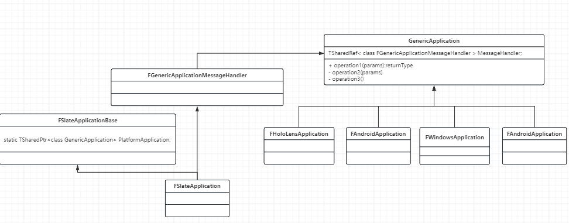

# UE5 一次搞懂输入的全套流程

这篇文章重点探讨的是虚幻引擎的输入方面的探讨。从源码角度分析整个流程。当我在源码处跑通这一整套流程的时候。

前情提要：

若要能够看懂下面的内容，需要对引擎的启动流程有一个简单的认识。同时对虚幻引擎的Slate框架有基本的认识。


基础概念介绍：

## FSlateApplication

引擎中的所有输入事件都会走到这里。他是引擎中窗口、UI 、TabManager的大管家。负责处理输入事件以及UI的绘制工作。

SWindow&#x20;

Slate框架中窗口的表示。其中含有很多和窗口相关的很多属性。


FLevelEditorViewport 关卡


首先我们从引擎的最大的循环开始说起，从最大的TIck函数开始讲起。

下面则是关于输入事件的Tick内容。

```cpp
if (FSlateApplication::IsInitialized() && !bIdleMode)
{
    {
       QUICK_SCOPE_CYCLE_COUNTER(STAT_FEngineLoop_ProcessPlayerControllersSlateOperations);
       check(!IsRunningDedicatedServer());

       // Process slate operations accumulated in the world ticks.
       ProcessLocalPlayerSlateOperations();
    }

    FSlateApplication::Get().Tick(ESlateTickType::PlatformAndInput);
}
```

下面是关于时间和Widgets绘制的Tick事件。

```cpp
// Tick(Advance) Time for the application and then tick and paint slate application widgets.
// We split separate this action from the one above to permit running network replication concurrent with slate widget ticking and painting.
if (FSlateApplication::IsInitialized() && !bIdleMode)
{
     FMoviePlayerProxy::SetIsSlateThreadAllowed(false);
     FSlateApplication::Get().Tick(ESlateTickType::TimeAndWidgets);
     FMoviePlayerProxy::SetIsSlateThreadAllowed(true);
}
```


<figure><figcaption></figcaption></figure>

从上面的图可以看出GenericApplication是总的应用程序类。下面的所有是子类是不同平台的具体实现。


下面来看相关输入的Tick函数：

```cpp
void FSlateApplication::Tick(ESlateTickType TickType)
{
	LLM_SCOPE_BYTAG(UI_Slate);

	SCOPE_TIME_GUARD(TEXT("FSlateApplication::Tick"));
	CSV_SCOPED_TIMING_STAT_EXCLUSIVE(UI);

	// It is not valid to tick Slate on any other thread but the game thread unless we are only updating time
	check(IsInGameThread() || TickType == ESlateTickType::Time);

	FScopeLock SlateTickAccess(&SlateTickCriticalSection);

	SCOPED_NAMED_EVENT_F(TEXT("Slate::Tick (%s)"), FColor::Magenta, LexToString(TickType));
	CSV_SCOPED_TIMING_STAT(Slate, Tick);

	{
		SCOPE_CYCLE_COUNTER(STAT_SlateTickTime);

		const float DeltaTime = GetDeltaTime();

		// IMPORTANT
		// Do not add code to these different if-statements, if you need to add additional logic to
		// ticking the platform, do it inside of TickPlatform, for example.  These functions are sometimes
		// called directly inside of Slate Application, so unless they're embedded in those calls, they wont
		// get run.
		
		if (EnumHasAnyFlags(TickType, ESlateTickType::PlatformAndInput))
		{
			TickPlatform(DeltaTime);
		}

		if (EnumHasAnyFlags(TickType, ESlateTickType::Time))
		{
			TickTime();
		}

		if (EnumHasAnyFlags(TickType, ESlateTickType::Widgets))
		{
			TickAndDrawWidgets(DeltaTime);
		}
	}
}
```


```cpp
void FSlateApplication::TickPlatform(float DeltaTime)
{
	SCOPED_NAMED_EVENT_TEXT("Slate::TickPlatform", FColor::Magenta);

#if WITH_ACCESSIBILITY
	{
		// We ensure to only call this in TickType::All to avoid the movie thread also calling this unnecessarily 
		GetAccessibleMessageHandler()->ProcessAccessibleTasks();
	}
#endif

	{
		SCOPE_CYCLE_COUNTER(STAT_SlateMessageTick);

		// We need to pump messages here so that slate can receive input.  
		if ( ( ActiveModalWindows.Num() > 0 ) || GIntraFrameDebuggingGameThread )
		{
			// We only need to pump messages for slate when a modal window or blocking mode is active is up because normally message pumping is handled in FEngineLoop::Tick
			PlatformApplication->PumpMessages(DeltaTime);

			if ( FCoreDelegates::StarvedGameLoop.IsBound() )
			{
				FCoreDelegates::StarvedGameLoop.Execute();
			}
		}

		PlatformApplication->Tick(DeltaTime);
		PlatformApplication->ProcessDeferredEvents(DeltaTime);
	}

	{
		SCOPE_CYCLE_COUNTER(STAT_SlateApplicationInput);

		const bool bCanSpawnNewTooltip = true;
		ForEachUser([this, bCanSpawnNewTooltip](FSlateUser& User) {
			User.UpdateCursor();
			User.UpdateTooltip(MenuStack, bCanSpawnNewTooltip);
		});

		bool bSynthesizedCursorMoveThisFrame = false;
		ForEachUser([&bSynthesizedCursorMoveThisFrame](FSlateUser& User) {
			bSynthesizedCursorMoveThisFrame |= User.SynthesizeCursorMoveIfNeeded();
		});
		bSynthesizedCursorMove = bSynthesizedCursorMoveThisFrame;

		// Generate any simulated gestures that we've detected.
		ForEachUser([this](FSlateUser& User) {
			User.GetGestureDetector().GenerateGestures(*this, SimulateGestures);
		});
	}
}
```


虚幻引擎输入事件体系：

FEventRouter


```
FName FEventRouter::FDirectPolicy::Name = "Direct";
FName FEventRouter::FToLeafmostPolicy::Name = "ToLeafmost";
FName FEventRouter::FTunnelPolicy::Name = "Tunnel";
FName FEventRouter::FBubblePolicy::Name = "Bubble";
```

上面的四个Router 就是路由 说成人话就是遍历。这下我可懂了&#x20;

上面展示了四种不同的遍历方式：

Direct 直接拿放进来的 然后结束遍历

ToLeafMostPolicy&#x20;

直接那Path 的最后面的一个也就是最后一个。假设数组是8，那的就是下标为7的。

FTunnelPolicy 是从前向后遍历

FBubblePolicy 执行的是从后向前遍历。


当我们点击Play的时候都发生了什么
